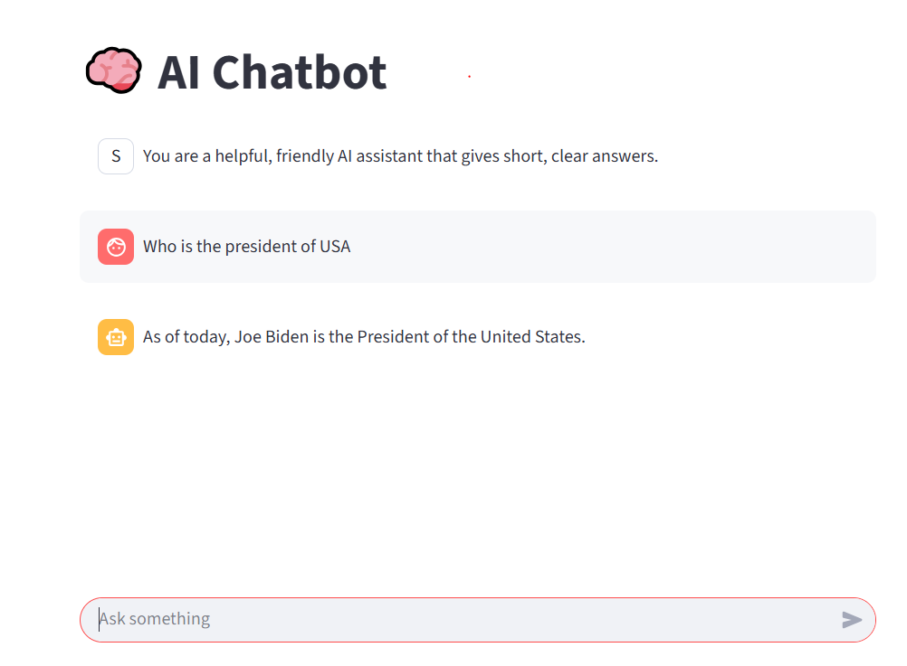

# 💬 AI Chatbot UI with Streamlit and OpenAI

This is a simple and elegant chatbot interface built using [Streamlit](https://streamlit.io/) and OpenAI’s GPT models.

## ✨ Features

- Minimal, responsive chat interface
- Real-time interaction using `gpt-3.5-turbo`
- Clean session-based memory for context-aware answers
- Easily customizable assistant prompt
- Built with Streamlit (zero deployment friction)

## 🔧 Tech Stack

- Python
- Streamlit
- OpenAI API
- dotenv

## 🚀 How to Run

1. Clone the repo:

2. Create a .env file:

OPENAI_API_KEY=your_key_here

3. Install dependencies:
pip install -r requirements.txt

4. Run the app:
streamlit run openai_streamlit-chatbot

## 💻 Demo

Here’s how the chatbot looks in action:

